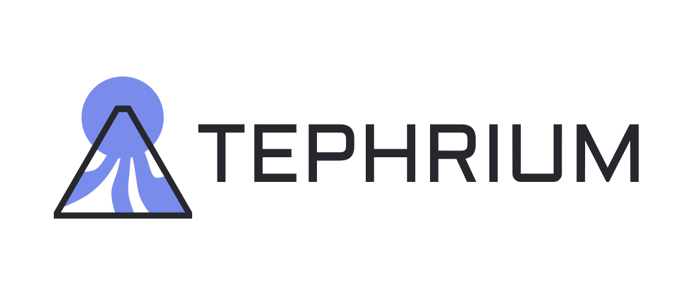

# Tephrium

<b>Tephrium is general purpose Java library mostly focused on mathematics.</b>

Tephrium is not focused on speed in particular, meaning that it's sometimes faster than other libraries and sometimes slower. 
For example, the matrix classes TMat2, TMat3, TMat4 are mutable row-major double matrices and they are actually faster 
than JOML's Matrix2d, Matrix3d and Matrix4d classes. 
(see <a hreF="https://github.com/oziris78/tephrium/tree/main/src/test/java/com/twistral/benchmarks">benchmarks</a>)


# Downloading

Add these to your build.gradle file:

```gradle
allprojects {
    // ...
    repositories {
        maven { url 'https://jitpack.io' }
    }
}

dependencies {
    implementation 'com.github.oziris78:tephrium:v0.9'
}
```


# Licensing

Tephrium is licensed under the terms of the Apache-2.0 license.

Also, the font used in the logo is called <a href="https://fonts.google.com/specimen/Aldrich">Aldrich</a>, which is a font licensed under the <a href="https://github.com/oziris78/tephrium/blob/main/legal/logo-font/Aldrich-Regular-License-OFL.txt">Open Font License</a>.


